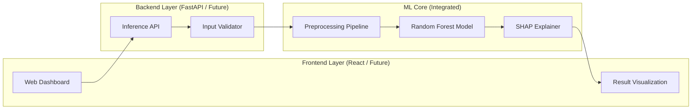
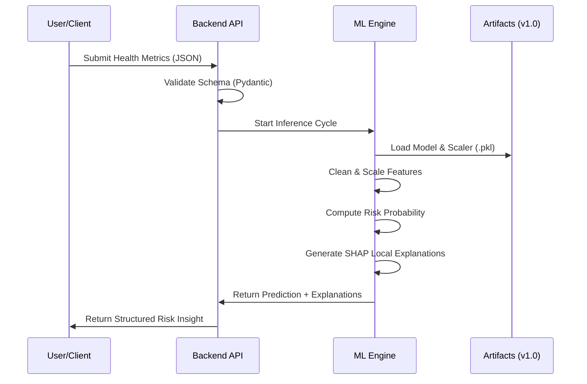

# MediGuide AI 🏥🤖

[](https://opensource.org/licenses/MIT)
[](https://www.python.org/downloads/)
[](https://scikit-learn.org/)
[](https://github.com/shap/shap)

**MediGuide AI** is an end-to-end machine learning system for diabetes risk assessment, emphasizing **explainability** and **clinical transparency**. It leverages ensemble learning and SHAP (SHapley Additive exPlanations) to provide evidence-based risk insights.

---

## 📋 Table of Contents

- [🚀 Project Overview](#-project-overview)
- [🏗️ System Architecture](#-system-architecture)
- [🔄 Process Workflow](#-process-workflow)
- [✨ Key Features](#-key-features)
- [🧠 Machine Learning Pipeline](#-machine-learning-pipeline)
- [📁 Project Structure](#-project-structure)
- [🛠️ Setup & Installation](#-setup--installation)
- [🩺 Safety & Ethics](#-safety--ethics)
- [🔮 Future Roadmap](#-future-roadmap)

---

## 🚀 Project Overview

MediGuide AI provides a framework for responsible healthcare AI. By combining predictive accuracy with model interpretability, it enables a deeper understanding of the factors driving health risk assessments.

> [!IMPORTANT]
> **MediGuide AI is a risk screening tool, not a diagnostic device.** It does not replace professional medical advice.

---

## 🏗️ System Architecture

The system is designed with a decoupled architecture, separating the machine learning logic from the presentation and API layers.



---

## 🔄 Process Workflow

This diagram illustrates the lifecycle of a single risk assessment request.



---

## ✨ Key Features

- **Robust Preprocessing**: Automated handling of medically invalid zero-values for critical metrics.
- **Ensemble Learning**: High-recall Random Forest Classifier for sensitive risk detection.
- **Explainable AI (XAI)**: Quantifiable feature impact scores for every individual assessment.
- **Production-Ready ML Core**: Strict schema enforcement and modular components.
- **Scalable Design**: Decoupled architecture ready for cloud deployment.

---

## 🧠 Machine Learning Pipeline

### Dataset
The model is trained on the **Pima Indians Diabetes Database**, focusing on 8 clinical features:
- Pregnancies, Glucose, Blood Pressure, Skin Thickness, Insulin, BMI, DiabetesPedigreeFunction, and Age.

### Model Performance
| Metric | Value |
|--------|-------|
| **Recall** | ~82% |
| **Precision** | ~78% |
| **ROC-AUC** | 0.87 |

---

## 🔍 Explainable AI (XAI)

We believe that in healthcare, "Why" is as important as "What".
- **Global Importance**: Highlights which features are most significant across the entire population.
- **Local Explanation**: For a specific patient, MediGuide AI shows exactly how their Glucose or BMI pushed the risk up or down.

---

## 📁 Project Structure

```text
MediGuide-AI/
├── ml/                 # Machine Learning Component (Core)
│   ├── notebooks/      # Research & EDA
│   ├── src/            # Modular Source Code (Preprocess, Train, Infer)
│   └── model_artifacts/ # Serialized Models & Scalers
├── data/               # Dataset Storage
├── backend/            # [Future] API Layer (FastAPI)
├── frontend/           # [Future] Web Interface (React)
└── docs/               # Documentation & Assets
```

---

## 🛠️ Setup & Installation

### 1. Environment Setup
```bash
# Clone the repository
git clone https://github.com/01mayankk/MediGuide-AI.git
cd MediGuide-AI

# Create and activate virtual environment
python -m venv venv
# Windows
.\venv\Scripts\Activate.ps1
# Mac/Linux
source venv/bin/activate

# Install dependencies
pip install -r ml/requirements.txt
```

### 2. Training the Model
```bash
python -m ml.src.train_model
```

---

## 🩺 Safety & Ethics

- **Transparency**: Every prediction is accompanied by an explanation.
- **Bias Mitigation**: Evaluation includes demographic sensitivity analysis.
- **Data Privacy**: No PII (Personally Identifiable Information) is stored or required.

---

## 🔮 Future Roadmap

- [ ] **Phase 1**: Complete FastAPI Backend Integration.
- [ ] **Phase 2**: Launch React-based Clinical Dashboard.
- [ ] **Phase 3**: Support for Heart Disease & Hypertension screening.
- [ ] **Phase 4**: Native Mobile Application (iOS/Android).

---

## 📄 License

This project is licensed under the MIT License - see the [LICENSE](LICENSE) file for details.
- Cloud deployment (Render, Netlify, Streamlit Cloud)
- CI/CD pipeline setup
- Error handling and logging

**Skills Demonstrated**:
- RESTful API development
- Modern frontend frameworks (React/Streamlit)
- Cloud deployment and DevOps
- Full-stack integration

---

## 📌 Resume & Interview Value

### What This Project Demonstrates

#### For ML Engineers:
✅ **End-to-End ML Deployment** – Not just notebooks, but production-ready inference pipelines  
✅ **Explainable AI** – SHAP implementation for high-stakes healthcare applications  
✅ **Domain-Specific ML** – Healthcare-specific evaluation metrics and threshold calibration  
✅ **Model Serialization & Serving** – Real-world API integration  

#### For Full Stack Developers:
✅ **Modern API Development** – FastAPI with async capabilities and auto-generated docs  
✅ **Frontend Integration** – React/Streamlit connecting to ML backend  
✅ **Cloud Deployment** – Hands-on experience with Render, Netlify, Streamlit Cloud  
✅ **Schema Validation** – Pydantic for robust data handling  

#### For All Candidates:
✅ **Production System Design** – Architecture that scales beyond MVP  
✅ **Ethical AI Practices** – Bias mitigation, transparency, medical disclaimers  
✅ **Responsible Scoping** – Focused MVP with clear roadmap  
✅ **Business Impact** – Addresses real-world healthcare accessibility problem  

### Interview Talking Points

1. **"Tell me about a challenging technical problem you solved"**
   - Balancing model recall (catching high-risk patients) vs. precision (avoiding false alarms)
   - Implementing SHAP for interpretability without slowing down inference

2. **"How do you approach ML model deployment?"**
   - Walk through the inference pipeline, API design, error handling, monitoring strategy

3. **"Describe a project where you worked with stakeholders"**
   - Healthcare domain requires understanding clinical guidelines, responsible disclaimers

4. **"What makes this different from typical ML projects?"**
   - Explainability requirements, ethical considerations, regulatory awareness

---

## 📄 License

This project is licensed under the MIT License - see the [LICENSE](LICENSE) file for details.

```
MIT License

Copyright (c) 2026 MediGuide AI

Permission is hereby granted, free of charge, to any person obtaining a copy
of this software and associated documentation files (the "Software"), to deal
in the Software without restriction, including without limitation the rights
to use, copy, modify, merge, publish, distribute, sublicense, and/or sell
copies of the Software, and to permit persons to whom the Software is
furnished to do so, subject to the following conditions:

The above copyright notice and this permission notice shall be included in all
copies or substantial portions of the Software.

THE SOFTWARE IS PROVIDED "AS IS", WITHOUT WARRANTY OF ANY KIND, EXPRESS OR
IMPLIED, INCLUDING BUT NOT LIMITED TO THE WARRANTIES OF MERCHANTABILITY,
FITNESS FOR A PARTICULAR PURPOSE AND NONINFRINGEMENT. IN NO EVENT SHALL THE
AUTHORS OR COPYRIGHT HOLDERS BE LIABLE FOR ANY CLAIM, DAMAGES OR OTHER
LIABILITY, WHETHER IN AN ACTION OF CONTRACT, TORT OR OTHERWISE, ARISING FROM,
OUT OF OR IN CONNECTION WITH THE SOFTWARE OR THE USE OR OTHER DEALINGS IN THE
SOFTWARE.
```

---

## 🙏 Acknowledgments

- Dataset sources: UCI Machine Learning Repository, CDC BRFSS
- Inspiration: WHO Diabetes Prevention Guidelines
- ML explainability: SHAP library by Scott Lundberg

---

## 📞 Contact & Contributions

**GitHub**: [https://github.com/01mayankk/MediGuide-AI](https://github.com/01mayankk/MediGuide-AI)

Contributions, issues, and feature requests are welcome! Feel free to check the [issues page](https://github.com/01mayankk/MediGuide-AI/issues).

---

**⚠️ Final Reminder**: This application is for educational and informational purposes only. Always consult qualified healthcare professionals for medical advice.