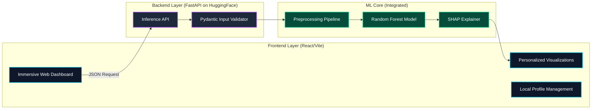
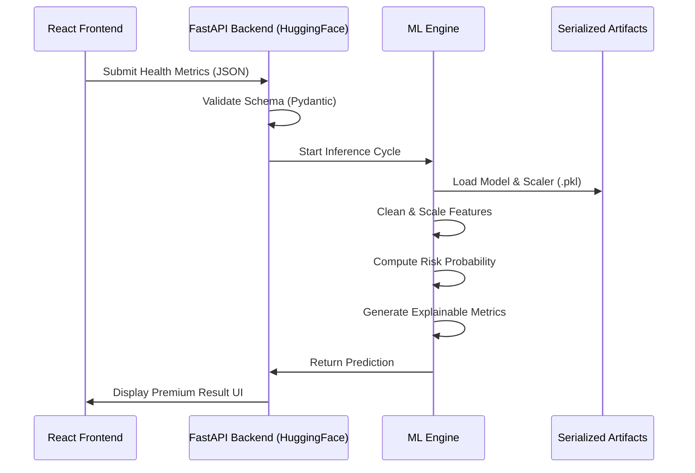

# MediGuide AI 🏥🤖

[](https://opensource.org/licenses/MIT)
[](https://www.python.org/downloads/)
[](https://reactjs.org/)
[](https://scikit-learn.org/)
[](https://github.com/shap/shap)
[](https://huggingface.co/)

**MediGuide AI** is an end-to-end machine learning system and premium clinical dashboard for diabetes risk assessment, emphasizing **explainability (XAI)**, **clinical transparency**, and **world-class user experience**. It leverages ensemble learning, SHAP (SHapley Additive exPlanations), and a deeply immersive React frontend to provide evidence-based risk insights.

---

## 📋 Table of Contents

- [🚀 Project Overview](#-project-overview)
- [🏗️ System Architecture](#-system-architecture)
- [🔄 Process Workflow](#-process-workflow)
- [✨ Key Features](#-key-features)
- [🧠 Machine Learning Pipeline](#-machine-learning-pipeline)
- [📁 Project Structure](#-project-structure)
- [🛠️ Setup & Installation](#-setup--installation)
- [🩺 Safety & Ethics](#-safety--ethics)

---

## 🚀 Project Overview

MediGuide AI provides a framework for responsible healthcare AI. By combining predictive accuracy with model interpretability and wrapping it in an accessible, beautiful application, it enables a deeper understanding of the factors driving health risk assessments for both clinicians and patients.

> [!IMPORTANT]
> **MediGuide AI is a risk screening tool, not a diagnostic device.** It does not replace professional medical advice.

---

## 🏗️ System Architecture

The system is designed with a decoupled architecture, separating the machine learning logic from the presentation and API layers.


```mermaid
graph LR
    classDef frontend fill:#0f172a,stroke:#06b6d4,stroke-width:2px,color:#fff;
    classDef backend fill:#1e293b,stroke:#a855f7,stroke-width:2px,color:#fff;
    classDef ml fill:#064e3b,stroke:#10b981,stroke-width:2px,color:#fff;

    subgraph "Frontend Layer (React/Vite)"
        UI[Immersive Web Dashboard]:::frontend
        ResultView[Personalized Visualizations]:::frontend
        Profiles[Local Profile Management]:::frontend
    end

    subgraph "Backend Layer (FastAPI on HuggingFace)"
        API[Inference API]:::backend
        Validator[Pydantic Input Validator]:::backend
    end

    subgraph "ML Core (Integrated)"
        PreProcess[Preprocessing Pipeline]:::ml
        Model[Random Forest Model]:::ml
        Explainer[SHAP Explainer]:::ml
    end

    UI -->|JSON Request| API
    API --> Validator
    Validator --> PreProcess
    PreProcess --> Model
    Model --> Explainer
    Explainer --> ResultView
```

---

## 🔄 Process Workflow

This diagram illustrates the lifecycle of a single risk assessment request.


```mermaid
sequenceDiagram
    participant User as React Frontend
    participant API as FastAPI Backend (HuggingFace)
    participant ML as ML Engine
    participant Data as Serialized Artifacts

    User->>API: Submit Health Metrics (JSON)
    API->>API: Validate Schema (Pydantic)
    API->>ML: Start Inference Cycle
    ML->>Data: Load Model & Scaler (.pkl)
    ML->>ML: Clean & Scale Features
    ML->>ML: Compute Risk Probability
    ML->>ML: Generate Explainable Metrics
    ML->>API: Return Prediction
    API->>User: Display Premium Result UI
```

---

## ✨ Key Features

- **Robust Preprocessing**: Automated handling of medically invalid zero-values for critical metrics.
- **Ensemble Learning**: High-recall Random Forest Classifier for sensitive risk detection.
- **Explainable AI (XAI)**: Quantifiable feature impact scores for every individual assessment.
- **Premium Glassmorphism UX**: A visually stunning frontend utilizing Neumorphism, Glassmorphism, and optically transparent 3D clinical assistants (via U-2-Net background removal).
- **Intelligent Profiling & Trending**: Local persistence of multiple patient profiles, automatic age calculation, and detailed AI-generated clinical advice based on historical metric deviations.
- **Production-Ready & Deployed**: Containerized Docker backend actively running on HuggingFace Spaces.

---

## 🧠 Machine Learning Pipeline

### Dataset
The model is trained on the **Pima Indians Diabetes Database**, focusing on 8 clinical features:
- Pregnancies, Glucose, Blood Pressure, Skin Thickness, Insulin, BMI, DiabetesPedigreeFunction, and Age.

### Model Performance
| Metric | Value |
|--------|-------|
| **Recall** | ~82% |
| **Precision** | ~78% |
| **ROC-AUC** | 0.87 |

---

## 📁 Project Structure

```text
MediGuide-AI/
├── ml/                 # Machine Learning Component (Core Logic)
│   ├── notebooks/      # Research & EDA
│   ├── src/            # Modular Source Code (Preprocess, Train, Infer)
│   └── model_artifacts/ # Serialized Models & Scalers
├── data/               # Dataset Storage
├── hf_space/           # Deployed FastAPI Backend Layer
│   ├── app/            # Main API Routes & Schemas
│   └── Dockerfile      # HuggingFace Space Deployment Config
├── frontend/           # Premium React Web Interface
│   ├── src/            # React Components, API Client, Premium CSS
│   └── public/         # 3D Transparent Assets
└── docs/               # Documentation & Assets
```

---

## 🛠️ Setup & Installation

You can run the full stack locally:

### 1. Backend API (FastAPI)
```bash
cd hf_space
pip install -r requirements.txt
uvicorn app.main:app --reload
```

### 2. Frontend Dashboard (React + Vite)
```bash
cd frontend
npm install
npm run dev
```

---

## 🩺 Safety & Ethics

- **Transparency**: Every prediction is powered by an explainable ensemble model.
- **Bias Mitigation**: Evaluation includes demographic sensitivity analysis.
- **Data Privacy**: No PII (Personally Identifiable Information) is stored or required on external servers. All historical trends are strictly persisted locally in the client browser.

---

## 🔮 Roadmap Achieved

- [x] **Phase 1**: Complete Core ML Pipeline & SHAP Explainer.
- [x] **Phase 2**: Containerize and Deploy FastAPI Backend API to HuggingFace.
- [x] **Phase 3**: Launch Premium React-based Clinical Dashboard Frontend.
- [x] **Phase 4**: Integrate immersive UI details (3D Assets, Historical Trends, Multi-User Profiles).

---

## 📄 License & Acknowledgments

This project is licensed under the MIT License - see the [LICENSE](LICENSE) file for details.

- Dataset sources: UCI Machine Learning Repository
- ML explainability: SHAP library
- AI UX Assets: Processed via U-2-Net (rembg)

**⚠️ Final Reminder**: This application is for educational and informational purposes only. Always consult qualified healthcare professionals for medical advice.