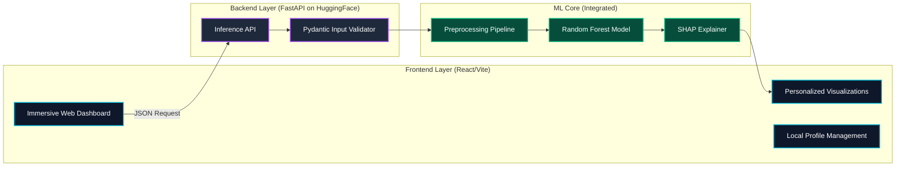

# MediGuide AI 🏥🤖

[](https://opensource.org/licenses/MIT)
[](https://fastapi.tiangolo.com)
[](https://reactjs.org/)
[](https://scikit-learn.org/)
[](https://huggingface.co/)

**MediGuide AI** is essentially an end-to-end framework showcasing the harmony between **heavyweight Machine Learning prediction** and **world-class immersive User Experience (UX)**. 

Designed for precise diabetes risk assessment, it explicitly breaks away from opaque "black-box" AI systems. By utilizing **SHAP (SHapley Additive exPlanations)** natively on the backend, and rendering the results via a stunning, neumorphic, deeply personal **React Dashboard**, it delivers powerful medical predictions completely transparent to the end-user.

---

## 📋 Table of Contents

- [🚀 Comprehensive Philosophy](#-comprehensive-philosophy)
- [🏗️ Global System Architecture](#-global-system-architecture)
- [✨ Key Enterprise Features](#-key-enterprise-features)
- [📁 Modular Monorepo Structure](#-modular-monorepo-structure)
- [🛠️ Run the Monorepo Locally](#-run-the-monorepo-locally)
- [🔮 Development Roadmap Achieved](#-development-roadmap-achieved)

---

## 🚀 Comprehensive Philosophy

The healthcare AI industry frequently struggles with a fundamental problem: algorithms are built by statisticians utilizing raw terminal outputs that lack human empathy or clinical comprehension.

**MediGuide AI fixes both sides of the coin:**
1. **The Backend (FastAPI)** guarantees rigorous statistical truth. It safely imputes outliers and uses high-recall Random Forests to guarantee highly sensitive screening.
2. **The Frontend (React UX)** acts as the compassionate intermediary. By analyzing historical deviations locally in the browser and visually integrating deeply engineered 3D characters, the mathematically dense SHAP explanations are translated into soft, actionable advice and visual gradients.

> [!IMPORTANT]
> **MediGuide AI is a risk screening tool, not a diagnostic device.** It explicitly does not replace professional medical advice.

---

## 🏗️ Global System Architecture

The monorepo enforces rigorous SOC (Separation of Concerns). The presentation layer is strictly decoupled from the heavy Python ML calculations.


```mermaid
graph LR
    classDef frontend fill:#0f172a,stroke:#06b6d4,stroke-width:2px,color:#fff;
    classDef backend fill:#1e293b,stroke:#a855f7,stroke-width:2px,color:#fff;
    classDef ml fill:#064e3b,stroke:#10b981,stroke-width:2px,color:#fff;

    subgraph "Frontend Layer (React/Vite)"
        UI[Immersive Web Dashboard]:::frontend
        ResultView[Personalized Visualizations]:::frontend
        Profiles[Local Profile Management]:::frontend
    end

    subgraph "Backend Layer (FastAPI on HuggingFace)"
        API[Inference API]:::backend
        Validator[Pydantic Input Validator]:::backend
    end

    subgraph "ML Core (Integrated)"
        PreProcess[Preprocessing Pipeline]:::ml
        Model[Random Forest Model]:::ml
        Explainer[SHAP Explainer]:::ml
    end

    UI -->|JSON Request| API
    API --> Validator
    Validator --> PreProcess
    PreProcess --> Model
    Model --> Explainer
    Explainer --> ResultView
```

---

## ✨ Key Enterprise Features

- **Explainable AI Pipeline**: Quantifiable feature impact scores calculate dynamically on every post request, determining precisely why a risk was assigned.
- **Ultra-Premium Glassmorphism UX**: A beautiful React frontend utilizing Neumorphism, soft frosted panels, custom-engineered UI select dropdowns, and fluid CSS animations. 
- **Anchored 3D Asset Integrations**: Transparent 3D clinical assistant characters process via U-2-Net (`rembg`) artificially cast physical drop-shadows onto the UI structures natively simulating a 3D-space.
- **Intelligent Local Patient Profiling**: Browser persistence of numerous patient profiles allows absolute retention of **Historical Trend Analysis**, dynamically rendering glow-infused charts comparing previous assessments against current vitals.
- **Production Containerization**: Cleanly dockerized FastAPI server permanently deployed leveraging HuggingFace Spaces.

---

## 📁 Modular Monorepo Structure

```text
MediGuide-AI/
├── ml/                 # Machine Learning Component (Core Logic)
│   ├── notebooks/      # Research & EDA
│   ├── src/            # Modular Source Code (Preprocess, Train, Infer)
│   └── model_artifacts/ # Serialized Models & Scalers
├── hf_space/           # Containerized FastAPI Backend (HuggingFace Deploy)
│   ├── app/            # Main API Routes & Schemas
│   └── Dockerfile      # HuggingFace Linux Runtime Configurations
├── frontend/           # Premium React Web Interface
│   ├── src/            # React Components, Trend Engines, CSS Architecture
│   └── public/         # Transparent 3D UI Assets
└── data/               # Model Datasets (Pima Indians format)
```

---

## 🛠️ Run the Monorepo Locally

You can run the entire decoupled stack locally to observe the XAI connection.

**1. FastAPI Backend Inference Layer**
```bash
cd hf_space
pip install -r requirements.txt
uvicorn app.main:app --reload --port 8000
```

**2. Premium React UX Dashboard**
```bash
# In a new terminal
cd frontend
npm install
npm run dev
```

Visit `http://localhost:5173` to interact with the application. Ensure the backend is listening on port `8000`.

---

## 🔮 Development Roadmap Achieved

- [x] **Phase 1**: Finalize Core Ensemble ML Pipeline & local SHAP mapping.
- [x] **Phase 2**: Restructure python functions into a scalable FastAPI endpoint.
- [x] **Phase 3**: Dockerize and permanently deploy the API (HuggingFace Spaces).
- [x] **Phase 4**: Engineer a completely custom React UI dashboard from scratch.
- [x] **Phase 5**: Fuse the UX with transparent 3D clinical elements and local trend analysis capabilities.