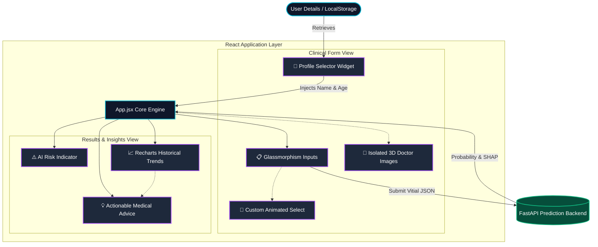

# MediGuide AI - Premium Health Dashboard 🏥🤖

The dynamic frontend interface for **MediGuide AI**, built entirely with React and Vite. This application provides a stunning, futuristic, and highly immersive clinical dashboard designed to rival top-tier electronic health record systems (like Apple Health), but with a much warmer and intuitive personalized approach.

## 🌟 Key Features

- **Premium Glassmorphism & Neumorphism UX**: A custom hybrid design system featuring deep, rich gradients, dynamic glowing charts, layered frosted glass panels, and floating elements.
- **Integrated 3D Clinical Assistants**: Beautifully rendered 3D characters perfectly integrated into the UI. AI background removal (via U-2-Net / `rembg`) guarantees optical transparency, allowing them to cast real physical drop-shadows onto the UI layers for a truly immersive experience.
- **Intelligent Patient Profiles**: Complete local browser persistence (via localStorage) of multiple user profiles. The system dynamically computes the precise age from Date of Birth to seamlessly feed into the backend prediction engine.
- **Detailed Historical Trend Analysis**: Full visual representation (via `recharts`) of patient metrics over time. Enhanced with a custom algorithm that detects precise metric deviations (e.g., Blood Pressure, Glucose) across tests and generates actionable, personalized clinical advice alongside color-coded badges.
- **AI Confidence Visualizer**: Dynamic shimmering progress bars converting mathematical clinical predictions into easily readable health metrics.
- **Fluid Dark/Light Modes**: The entire aesthetic gracefully transitions between a sleek clinical white layout and a deep, neon-accented space navy.
- **Custom React Components**: Entirely engineered native UI elements, including a completely custom animated Dropdown component providing flawless visual consistency across browsers.

## 🏗️ Frontend Architecture Flow

The following Mermaid diagram maps out the core React component interactions, state transfers, and integrations with the prediction backend.



## 🛠️ Technology Stack

- **Framework**: React 18 + Vite (lightning-fast HMR)
- **Styling**: Pure CSS variables mastering modern web paradigms (`backdrop-filter`, Neumorphic `box-shadows`, CSS Grid/Flexbox, and keyframe animations). Built explicitly without bulky external UI component libraries.
- **Data Visualization**: `Recharts` for accessible, beautifully glowing historical graphs.
- **Iconography**: `lucide-react` modern SVGs.

## 🚀 Getting Started

### Prerequisites
- Node.js (v16 or higher)
- NPM or Yarn

### Installation & Local Dev

```bash
# Clone the repository and navigate to the frontend directory
cd frontend

# Install dependencies
npm install

# Start the development server
npm run dev
```

Visit `http://localhost:5173` in your browser.

## 🔗 Architecture Link
This frontend connects seamlessly to the Python FastAPI predictive engine. Ensure you have the `hf_space/` backend running or securely deployed to fully utilize the risk assessment features!
