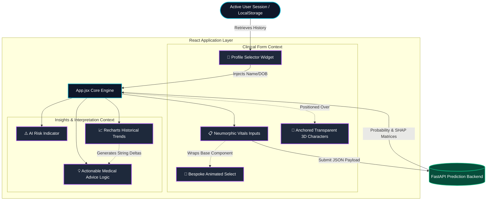

# MediGuide AI - Premium Health Dashboard 🏥🤖

The dynamic frontend interface for **MediGuide AI**, built strictly from scratch with React and Vite. This application provides a stunning, futuristic, and highly immersive clinical dashboard designed specifically to surpass the generic "Admin Panel" feel typical of AI tools. By utilizing custom CSS architectures, the site closely mirrors top-tier electronic health record systems (like Apple Health), but wrapped in a dramatically warmer and intuitive customized presentation.

## 🌟 The UX Philosophy & Deep Features

The goal of this interface is to translate highly complex backend statistical output (mathematical matrices, probabilities, and SHAP analyses) into deeply human, empathetic, and visually effortless feedback.

- **Deep Glassmorphism & Neumorphism UX**: Constructed a hybrid design system using no bloated external UI frameworks (No Material-UI or Tailwind limitations). Features rich dynamic gradients, glowing fluid charts, layered frosted glass panels (`backdrop-filter: blur`), and subtle inset floating elevations making the UI feel physical and interactive.
- **Integrated 3D Clinical Assistants**: A key USP. Beautifully rendered cartoon 3D characters are completely integrated into the physical UI space. Because their background was computationally removed (`rembg`), they optically sit on the edge of CSS form cards, projecting dynamic CSS `drop-shadows` downward to establish native physical presence within the layout.
- **Intelligent Multiple Patient Profiling**: Complete local browser database persistence via `localStorage` allowing users to track multiple people (family members). The system seamlessly and dynamically computes absolute age from a structured Date of Birth to supply accurate metrics.
- **Robust Historical Trend Analysis Engine**: A completely bespoke local tracking system that constructs mathematical deltas across time. Visualized via heavily customized `recharts` glowing line graphs. It scans historical states recursively and automatically injects dynamically generated, custom clinical advice strings based on localized drops or spikes in key metrics (e.g., Blood Sugar improvements, BMI rises).
- **AI Confidence Shimmer Visualizer**: Converting clinical predictions into immediate emotional clarity with animated, shimmering percentage progress bars that escalate in color severity exactly matching risk logic.
- **Custom React Select Structures**: Native HTML `<select>` elements destroyed immersion. Entirely engineered an animated, state-driven custom React Dropdown component that guarantees flawless alignment with the overall Glassmorphism design system.

## 🏗️ Frontend Architecture Flow

The following Mermaid diagram maps out the core React component interactions, isolated component rendering, and how the state propagates out to the backend and back into visual charting.



## 🛠️ Technology Stack Extrapolated

- **Framework Engine**: React 18 + Vite (Enabling lightning-fast HMR and minimal bundle sizes).
- **CSS Architecture**: Pure CSS3 (`index.css` ~900 lines) mastering absolute positioning, variable-based theme scaling, variable-level transparency, and keyframe `slideDown` optimizations.
- **Data Visualization**: `Recharts` mapped specifically stripped down to only paths mapping to customized tooltips and SVG gradient definitions for glowing aesthetics.
- **Iconography System**: `lucide-react` modern SVGs rendered uniformly.
- **Computational Asset Processing**: AI characters sliced flawlessly via `U-2-Net` neural removal guaranteeing UI layer transparency depth.

## 🚀 Running The Frontend

### Prerequisites
- Node.js (v16+)
- NPM or Yarn

### Installation

```bash
# Clone the repository and navigate to the frontend directory
cd frontend

# Install package dependencies
npm install

# Start the Vite hyper-fast development server
npm run dev
```

Visit `http://localhost:5173` in your browser. Note: For risk probabilities to compute, the FastAPI backend layer must be actively running or resolving from the cloud endpoint.
